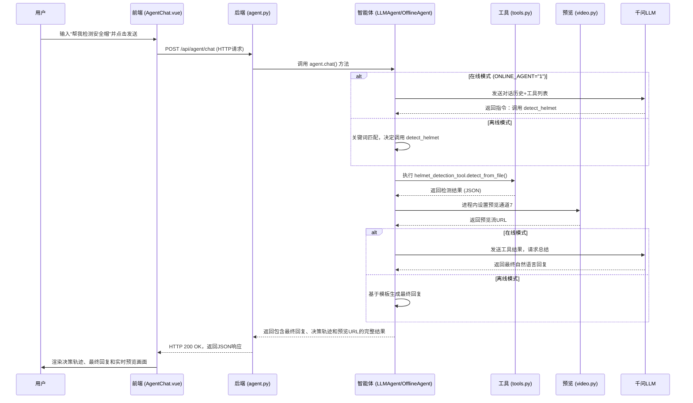

# 智能体端到端调用流程详解（以“安全帽检测”为例）

本文档将详细拆解当你在前端输入“帮我检测安全帽”后，从前端到后端，再到结果呈现的每一步，让你清晰地了解整个系统的运作流程、涉及的文件、函数调用关系以及数据是如何流转的。

---

### 流程概览



---

### 步骤 1: 前端 - 用户输入与发送

- **文件**: `yunliu-mining-ai-system/src/views/AgentChat.vue`

1.  **事件触发**: 你在输入框输入“帮我检测安全帽”，然后点击“发送”按钮。
2.  **函数调用**: 按钮的 `@click` 事件触发了 `sendMessage()` 函数。
3.  **数据打包**: `sendMessage()` 将你的输入文本打包成一个JSON对象：
    ```json
    {
      "message": "帮我检测安全帽",
      "use_tools": true
    }
    ```
4.  **发送请求**: `sendMessage()` 内部调用 `sendMessageHTTP()`，通过 `fetch` API向后端发送一个HTTP POST请求。
    *   **URL**: `http://localhost:8001/api/agent/chat`
    *   **方法**: `POST`
    *   **请求体**: 上面打包好的JSON数据。

---

### 步骤 2: 后端 - 接收请求与智能体决策

- **文件**: `MultiDetection-backend/app/api/endpoints/agent.py`

1.  **路由匹配**: FastAPI应用接收到请求，并将其路由到 `@router.post("/chat")` 装饰的 `chat()` 函数。
2.  **选择智能体**: `chat()` 函数首先会检查环境变量 `ONLINE_AGENT`。
    *   如果 `ONLINE_AGENT` 为 `"1"` 并且在线智能体 `agent_online` 初始化成功，它会选择 `agent_online`。
    *   否则，它会选择默认的 `agent_offline`（离线兜底）。
3.  **调用智能体核心**: 接着，它调用当前活动智能体的 `chat()` 方法，并将用户消息传递进去。
    *   `result = await active_agent.chat(request.message)`

---

### 步骤 3: 智能体核心 - 意图识别与工具调用

#### 场景 A: 在线模式 (`llm_agent.py`)

1.  **与LLM交互**: `LLMAgent.chat()` 将你的消息和所有已注册工具的“说明书”一起发送给**千问LLM**。
2.  **LLM决策**: 千问LLM分析后，认为 `detect_helmet` 工具最匹配，于是返回一个包含工具调用指令的响应。
    *   这个指令大致是：`{"tool_calls": [{"id": "...", "function": {"name": "detect_helmet", "arguments": "{}"}}]}`
3.  **执行工具**: `LLMAgent` 解析这个指令，并调用 `_execute_tool_calls()`，该函数会找到名为 `detect_helmet` 的工具，并执行它注册的Python函数：`helmet_detection_tool.detect_from_file()`。

#### 场景 B: 离线模式 (`agent.py` 中的 `OfflineAgent`)

1.  **关键词匹配**: `OfflineAgent.chat()` 方法会检查你的消息中是否包含“安全帽”、“检测”或“helmet”等关键词。
2.  **直接决策**: 匹配成功后，它直接决定调用 `detect_helmet` 工具。
3.  **执行工具**: 它直接在代码中调用 `helmet_detection_tool.detect_from_file()`。

---

### 步骤 4: 工具执行 - 真正的“功能”干活

- **文件**: `MultiDetection-backend/app/tools.py`

1.  **函数被调用**: `helmet_detection_tool.detect_from_file()` 被执行。
2.  **检查参数**: 函数发现 `file_path` 参数为空。
3.  **自动选择文件**: 它会自动扫描 `E:\...\MultiDetection-backend\output_parts` 目录，找到第一个 `.mp4` 文件作为输入。
4.  **视频处理**: 使用OpenCV (`cv2.VideoCapture`) 按帧读取视频。
5.  **YOLO检测**: 对每一帧（或抽样的帧），调用YOLO模型进行目标检测。
6.  **结果汇总**: 统计所有帧中的“person”和“helmet”数量，并生成一个详细的JSON结果。
7.  **返回结果**: 将这个包含所有检测信息的JSON对象返回给调用它的智能体。

---

### 步骤 5: 启动实时预览

- **文件**: `MultiDetection-backend/app/api/endpoints/agent.py`

1.  **获取检测文件路径**: 在 `OfflineAgent.chat()`（或 `LLMAgent` 的相应逻辑中），从工具返回的结果中提取出实际使用的视频文件路径 `used_file`。
2.  **绑定预览通道**: 它直接在**进程内**访问 `video.py` 中的全局变量，将 **7号通道** 的视频路径设置为 `used_file`。
    *   `video_paths[7] = used_file`
3.  **生成预览URL**: 它构造出前端可以直接访问的MJPEG流地址：`http://localhost:8001/api/video/video_stream/7`。
4.  **附加到结果**: 这个 `preview_stream_url` 被添加到一个新的工具结果中，一起返回给前端。

---

### 步骤 6: 生成最终回复

#### 场景 A: 在线模式

1.  `LLMAgent` 将 `detect_helmet` 的执行结果再次发送给**千问LLM**。
2.  **千问LLM** 分析这个JSON结果，并生成一段专业的、人类可读的分析报告。

#### 场景 B: 离线模式

1.  `OfflineAgent` 从工具结果中提取关键数据（人数、安全帽数等）。
2.  使用一个预设的f-string模板生成一句简单的总结性回复，例如：“已完成安全帽检测。视频: ...。发现人员: ...”。

---

### 步骤 7: 返回前端并渲染

- **文件**: `yunliu-mining-ai-system/src/views/AgentChat.vue`

1.  **接收响应**: 前端的 `sendMessageHTTP()` 收到一个包含所有信息的HTTP 200响应。
    *   **数据结构**: `{"message": "...", "tool_calls": [...], "tool_results": [...], "decision_trace": [...]}`
2.  **更新UI**: Vue将这个新消息对象 push 到 `messages` 数组中。
3.  **渲染决策轨迹**: 模板中的 `v-for` 遍历 `decision_trace`，使用 `el-timeline` 组件将其渲染成一个时间线。
4.  **渲染工具结果**: `el-collapse` 组件将 `tool_results` 渲染成可折叠的JSON代码块。
5.  **渲染实时预览**: 模板中的 `v-if="getPreviewUrl(result)"` 发现某个工具结果中包含了 `preview_stream_url`，于是它渲染出一个 `` 标签，其 `src` 指向这个URL，浏览器开始拉取并显示MJPEG流。
6.  **渲染最终回复**: 最终的自然语言回复被显示在消息的顶部。

至此，从你的一句“人话”指令，到系统自动完成检测、分析、预览和汇报的整个闭环就完成了。

